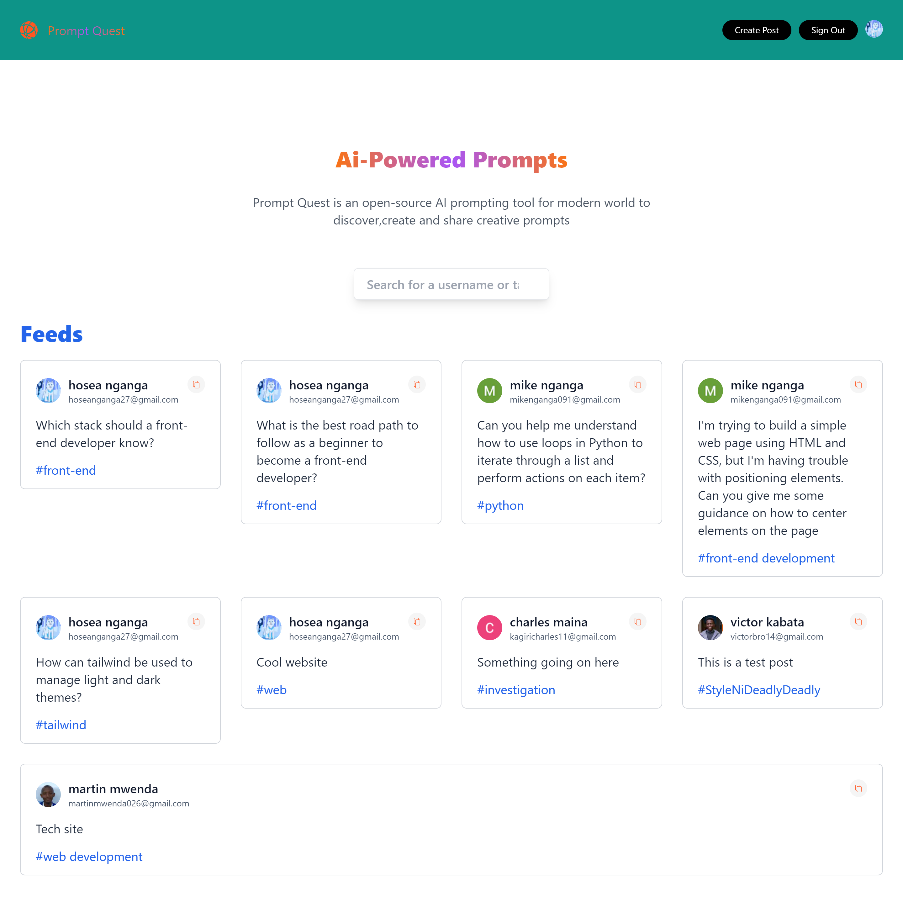
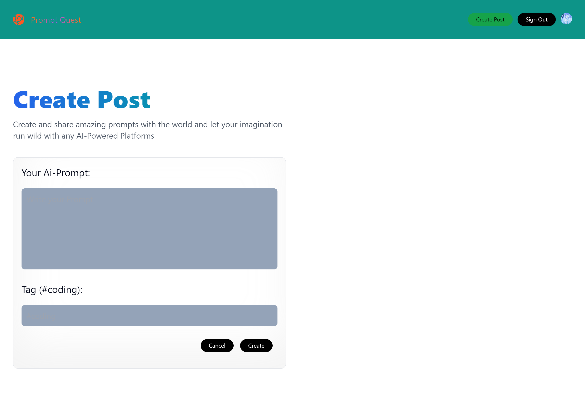
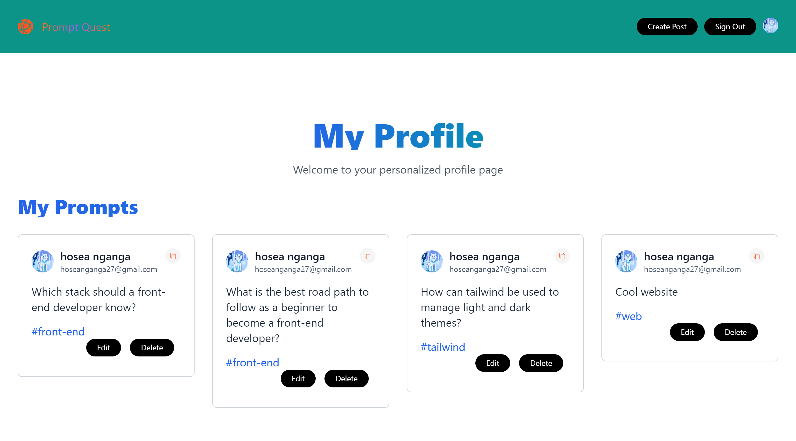

# Prompt-Quest-App

This project revolves around the development of a dynamic platform for generating AI-Powered Prompts, fostering a collaborative environment where users can create, share, and engage with diverse prompts crafted by both themselves and fellow users.

<div align='center'></div>

<h2>Screenshots of the Project 📸</h2>
<br>
<h3 align='center'>Home Page 🏡</h3>

<div align='center'>


</div>
<br><br>
<h3 align='center'>Create Feed Page 👇</h3>

<div align='center'>

</div>
<br>
<br>
<h3 align='center'>Profile Page 👇</h3>

<div align='center'>

</div>
<br>
<br>

## Project Structure

This application facilitates user authentication via email login, enabling users to access various features such as creating and editing posts. Leveraging MongoDB as the backend database, user creation is managed through Mongoose, a MongoDB object modeling tool designed for Node.js.

The core functionalities of this application include:

- **User Authentication**: Users can securely log in using their email credentials, ensuring personalized experiences and data security.

- **Post Creation and Editing**: Authenticated users can create new posts and edit existing ones, enhancing user engagement and content management within the platform.

- **Profile Page**: Each user has a dedicated profile page where they can view details of their activity, including the posts they have created. This feature enhances user engagement and facilitates personalization.

- **Feed Page**: Users can browse through a feed of posts created by other users, fostering community interaction and content discovery. Clicking on posts enables users to view the profile of the respective post creator.

## Usage

- **Prerequisites**

Before you begin, ensure you have met the following requirements:

- Node.js and npm installed on your local machine.
- MongoDB installed and running locally or accessible remotely.

- **Getting Started**

To get a local copy up and running, follow these simple steps.

1. **Clone the repository:**

- ```bash
  git clone https://github.com/your-username/your-repository.git
  ```

2. **Navigate to the project directory:**

- cd your-project-directory

3. **Install dependencies:**

- npm-install

4. **Set Up environment Variables:**

- Create a .env file in the root directory.
- Define environment variables specifically:

1.  GOOGLE_ID=your-google-client-id
2.  GOOGLE_CLIENT_SECRET=your-google-client-secret
3.  MONGODB_URI=your-mongodb-uri
4.  NEXTAUTH_URL=your-nextauth-url
5.  NEXTAUTH_URL_INTERNAL=your-nextauth-internal-url
6.  NEXTAUTH_SECRET=your-nextauth-secret

7.  **Start the development server:**

- npm run dev

To run the project locally:

1. Clone the repository.
2. Install dependencies using `npm install`.
3. Start the development server using `npm start`.

## Contributing

Contributions are welcome! If you'd like to contribute to this project, please fork the repository and submit a pull request with your changes.

## License

This project is licensed under the MIT License - see the [LICENSE](./LICENSE) file for details.
